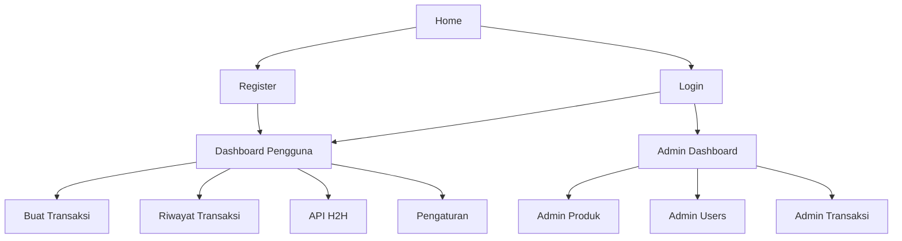

## 1. Product Overview
Aplikasi top-up & transaksi digital dengan dashboard pengguna, H2H API, dan panel admin.
Fokus dokumen ini: audit menu frontend↔backend dan rencana sinkronisasi agar semua menu berfungsi konsisten dengan UI modern-minimalis profesional.

## 2. Core Features

### 2.1 User Roles
| Role | Registration Method | Core Permissions |
|------|---------------------|------------------|
| Pengguna | Daftar via form Register | Login, lihat dashboard, buat transaksi, lihat riwayat, kelola API key, ubah profil |
| Admin | Akun ber-role admin | Akses panel admin: statistik, kelola produk, kelola user, lihat transaksi |

### 2.2 Feature Module
1. **Home**: landing, CTA login/daftar.
2. **Login & Register**: autentikasi dan pembuatan akun.
3. **Dashboard Pengguna**: ringkasan saldo, katalog layanan, akses menu.
4. **Buat Transaksi**: pilih produk + nomor tujuan + submit.
5. **Riwayat Transaksi**: daftar transaksi, pencarian.
6. **API H2H**: generate kredensial + IP whitelist + panduan.
7. **Pengaturan**: update profil + preferensi.
8. **Panel Admin**: statistik, kelola produk, kelola user, daftar transaksi.

### 2.3 Page Details
| Page Name | Module Name | Feature description |
|-----------|-------------|------------------|
| Home (/) | CTA | Arahkan ke /login dan /register. |
| Login (/login) | Auth | Login dan simpan token+user ke localStorage. (BE: POST /api/auth/login) |
| Register (/register) | Auth | Registrasi akun baru. (BE: POST /api/auth/register) |
| Dashboard (/dashboard) | Profile & Summary | Ambil profil+saldo. (BE: GET /api/users/profile) |
| Dashboard (/dashboard) | Katalog layanan | Tampilkan produk per kategori. (Audit: saat ini hardcoded; rencana pakai BE: GET /api/products) |
| Buat Transaksi (/transaction) | Form transaksi | Load produk & submit transaksi. (BE: GET /api/products, POST /api/transactions) |
| Riwayat (/transactions) | List & Search | Ambil daftar transaksi user + filter. (BE: GET /api/transactions) |
| API H2H (/dashboard/api) | Kredensial & IP | Generate API key/secret + update ipWhitelist. (BE: POST /api/users/api-keys, PATCH /api/users/:id) |
| Pengaturan (/dashboard/settings) | Profil | Update nama/email/phone & preferensi. (Audit: UI masih dummy; rencana pakai BE: GET /api/users/profile, PATCH /api/users/:id) |
| Admin (/admin) | Stats | Ambil statistik admin. (BE: GET /api/admin/stats) |
| Admin Produk (/admin/products) | CRUD produk | Buat/ubah/hapus produk. (BE: POST/GET/PATCH/DELETE /api/products) |
| Admin Users (/admin/users) | List user | Lihat daftar user. (BE: GET /api/admin/users) |
| Admin Transaksi (/admin/transactions) | List transaksi | Lihat seluruh transaksi. (BE: GET /api/admin/transactions) |

### 2.4 Audit Menu Frontend ↔ Backend (Ringkas)
| Menu (UI) | Route | Panggilan Backend yang ada di FE | Status | Gap / Aksi Sinkronisasi |
|---|---|---|---|---|
| Dashboard | /dashboard | GET /users/profile | OK | Katalog layanan masih hardcoded → gunakan GET /products + filter kategori. |
| Transaksi | /transaction | GET /products, POST /transactions | OK | Pastikan response seragam (array vs {data}). |
| Riwayat | /transactions | GET /transactions | OK | Tambah endpoint detail jika tombol “chevron” dipakai (opsional: GET /transactions/:id). |
| Analytics | /dashboard/analytics | (belum terlihat panggilan API) | Risiko | Putuskan: (a) hitung client-side dari /transactions, atau (b) tambah API ringkasan. |
| API H2H | /dashboard/api | GET /users/profile, POST /users/api-keys, PATCH /users/:id | OK* | Verifikasi UpdateUserDto mendukung ipWhitelist; tampilkan error state UI. |
| Pengaturan | /dashboard/settings | (TODO) | Belum | Implementasikan GET/ PATCH user profile + validasi form. |
| Admin Dashboard | /admin | GET /admin/stats | OK | Selaraskan role check: FE pakai 'admin' vs BE enum Role.ADMIN. |
| Admin Produk | /admin/products | (create sudah) POST /products | Sebagian | Pastikan list/edit/delete memakai endpoint sama + guard role. |
| Admin Users | /admin/users | GET /admin/users | OK | Tambahkan empty/error state konsisten. |
| Admin Transaksi | /admin/transactions | GET /admin/transactions | OK | Tambahkan filter status (opsional). |

## 3. Core Process
**Flow Pengguna**: Home → Register/Login → Dashboard (ambil profil) → Buat Transaksi (ambil produk, submit) → Riwayat (monitor status) → (opsional) API H2H (generate key, set IP whitelist) → Pengaturan (update profil).

**Flow Admin**: Login → Admin Dashboard (stats) → Kelola Produk (CRUD) → Lihat Users/Transaksi.

**Rencana Sinkronisasi (prioritas eksekusi)**
1) Standarisasi kontrak respons FE (selalu {status,data,message}) atau buat adapter di FE untuk semua endpoint.
2) Dashboard katalog: ganti data hardcoded → GET /api/products + filter kategori.
3) Pengaturan: implement GET /users/profile + PATCH /users/:id; sinkronkan field (name,email,phone,ipWhitelist).
4) Analytics: gunakan perhitungan client-side berbasis GET /transactions untuk MVP; jika performa/fitur berkembang, tambah endpoint ringkasan.
5) Perapihan akses: samakan definisi role FE dengan BE (admin/superaccess) + guard route.

