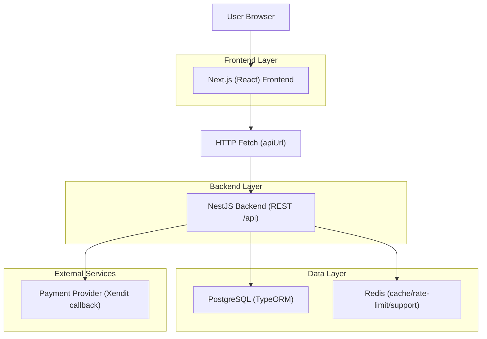
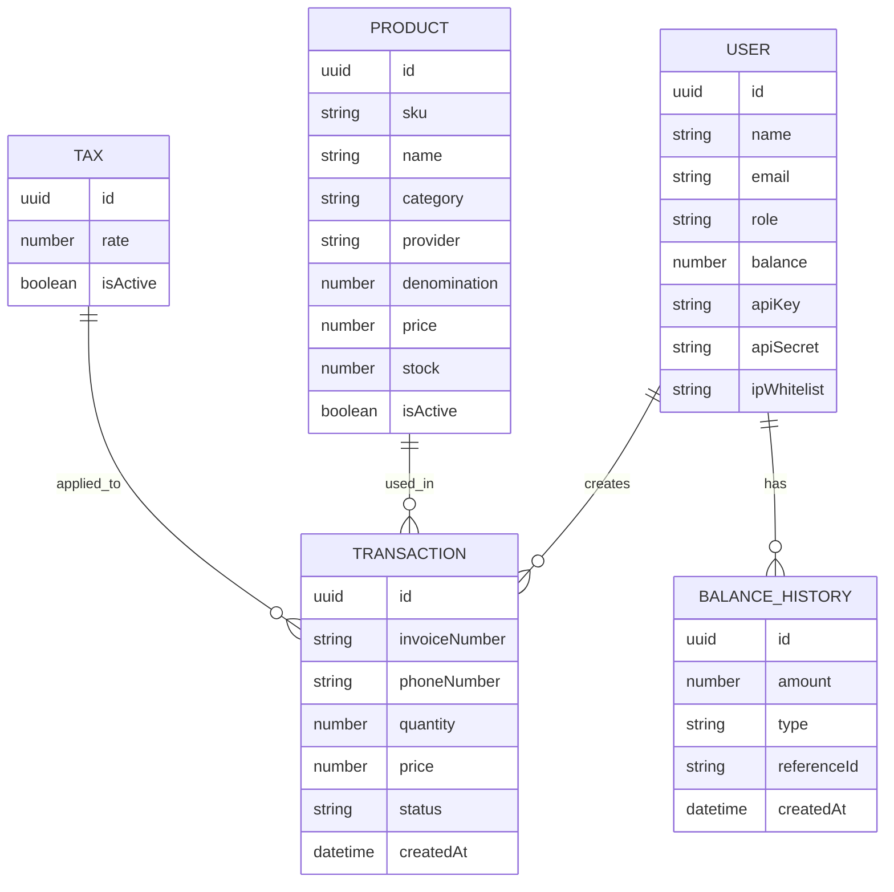

## 1.Architecture design

## 2.Technology Description
- Frontend: Next.js (React) + TypeScript + TailwindCSS + shadcn/ui components
- Backend: NestJS + TypeScript + JWT Auth + API Key Guard + Throttler + Helmet
- Database: PostgreSQL (TypeORM)
- Cache/Infra: Redis

## 3.Route definitions
| Route | Purpose |
|-------|---------|
| / | Landing + CTA login/register |
| /login | Login pengguna/admin |
| /register | Registrasi |
| /dashboard | Dashboard pengguna |
| /transaction | Form transaksi |
| /transactions | Riwayat transaksi |
| /dashboard/api | Manajemen API H2H |
| /dashboard/settings | Pengaturan profil |
| /admin | Dashboard admin |
| /admin/products | Kelola produk |
| /admin/users | Kelola user |
| /admin/transactions | Pantau transaksi |

## 4.API definitions
### 4.1 Core API (ringkas)
Auth
- POST /api/auth/register
- POST /api/auth/login
- GET /api/auth/profile
- POST /api/auth/refresh

User
- GET /api/users/profile
- POST /api/users/api-keys
- GET /api/users/balance/history
- PATCH /api/users/:id

Produk
- GET /api/products
- POST /api/products (Admin)
- PATCH /api/products/:id (Admin)
- DELETE /api/products/:id (Admin)

Transaksi
- GET /api/transactions
- POST /api/transactions
- GET /api/transactions/:id
- GET /api/transactions/invoice/:invoiceNumber
- PATCH /api/transactions/:id/status

H2H (API Key Guard)
- GET /api/h2h/balance
- GET /api/h2h/products
- POST /api/h2h/transaction
- GET /api/h2h/transaction/:invoiceNumber

Admin
- GET /api/admin/stats
- GET /api/admin/transactions
- GET /api/admin/users
- GET /api/admin/revenue
- POST /api/admin/topup

Payment (callback)
- POST /api/payment/create-va
- GET /api/payment/status/:externalId
- POST /api/payment/webhook
- POST /api/payment/xendit/callback

## 6.Data model(if applicable)
### 6.1 Data model definition
